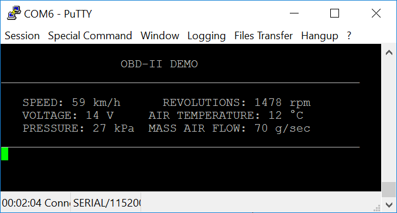
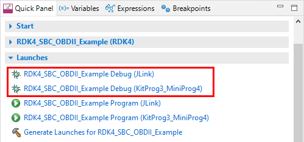
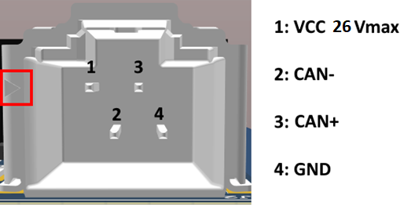
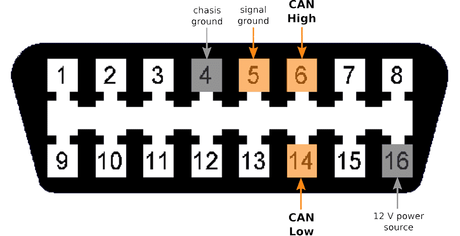
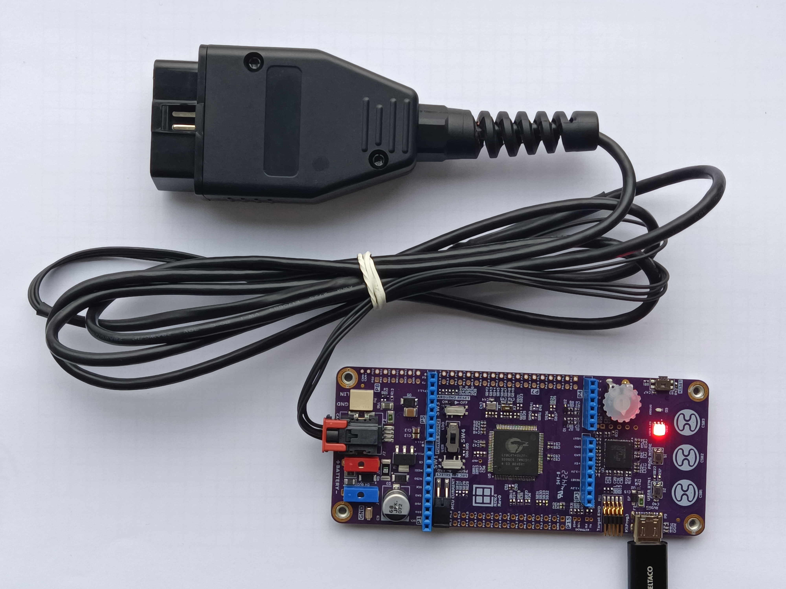

# RDK4 SBC OBDII Example

Rutronik Development Kit 4 Programmable System-on-Chip CY8C4149AZE-S598 "System Basis Chip OBDII Example". 

This application is intended to be used as a reference firmware example for the developers who need to quick-start with PSoC4100S Max and System Basis Chip TLE9262-3BQXV33 CANFD OBD-II protocol.

 

## Requirements

- [ModusToolbox® software](https://www.infineon.com/cms/en/design-support/tools/sdk/modustoolbox-software/) v3.0

### Using the code example with a ModusToolbox IDE:

1. Import the project: **File** > **Import...** > **General** > **Existing Projects into Workspace** > **Next**.
2. Select the directory where **"RDK4_SBC_OBDII_Example"** resides and click  **Finish**.
3. Update libraries using  a **"Library Manager"** tool.
4. Select and build the project **Project ** > **Build Project**.

### Operation

The firmware example uses KitProg3 Debug UART for debug output. Some of the most common OBD-II PIDs are presented twice per second: Vehicle speed (0x0D), Engine speed (0x0C), Control module voltage (0x66), Intake air temperature (0x0F), Intake manifold absolute pressure (0x0B), Mass air flow sensor air flowrate (0x10). 

The Green and Red USER LEDs indicate whether the device has the connection with the CAN network using standard OBD-II  protocol or not. The result shown below was taken from a real vehicle while driving. 

### Debugging

If you successfully have imported the example, the debug configurations are already prepared to use with a the KitProg3, MiniProg4, or J-link. Open the ModusToolbox perspective and find the Quick Panel. Click on the desired debug launch configuration and wait for the programming to complete and debugging process to start.

### OBD-II Cable Assembly

The OBD-II cable is not included to the RDK4 development kit, hence it is needed to assemble it before the example could be fully tested with a vehicle. The part of the cable is provided by Rutronik and comes together with RDK4's package. It is a cable for the Amphenol ICC Minitek MicroSpace**™** header Part No.: **10142344-104KLF**. The rest has to be done by the developers. Soldering skills are needed to assemble the OBD-II socket, please pay attention to the pinouts shown below:

 

Once the cable is assembled, the RDK4 can be connected and powered from the vehicles power system.  

## Legal Disclaimer

The evaluation board including the software is for testing purposes only and, because it has limited functions and limited resilience, is not suitable for permanent use under real conditions. If the evaluation board is nevertheless used under real conditions, this is done at one’s responsibility; any liability of Rutronik is insofar excluded. 

